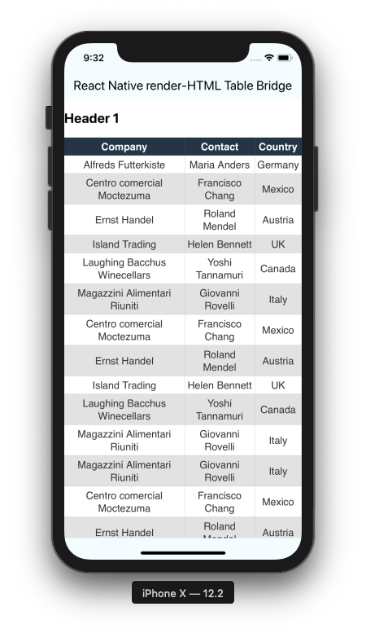

# Table support for react-native-render-html

**Features**:

- Render HTML tables with a `WebView` component you provide
- Supports `<HTML>onLinkPress` prop to handle clicks
- Automatic height



**Known Limitations**:

- don't forget you're rendering cells inside a webview, so you won't be able to apply your custom renderers there
- limited support of Expo prior to 33 version ; full support [33+ versions](https://github.com/expo/expo/milestone/22) (see bellow limitation)
- `autoheight` and `onLinkPress` config options only work with [`WebView >= v5.0.0` community edition](https://github.com/react-native-community/react-native-webview/releases/tag/v2.14.0)

## Minimal working example

*[Full example](examples/simple)*

You need 3 mandatory steps to get to a working example:

1. If you're not using Expo, install and link `react-native-webview` if you havent't yet
2. inject `alterNode` and `ignoredTags` props to `HTML` component
3. `makeTableRenderer` and inject `renderers` prop `HTML` component

```javascript
import React, {PureComponent} from 'react';
import {ScrollView} from 'react-native';
import HTML from 'react-native-render-html';
import { IGNORED_TAGS, alterNode, makeTableRenderer } from 'react-native-render-html-table-bridge';
import WebView from 'react-native-webview';

const html = `
<table>
  <tr>
    <th>Entry Header 1</th>
    <th>Entry Header 2</th>
  </tr>
  <tr>
    <td>Entry First Line 1</td>
    <td>Entry First Line 2</td>
  </tr>
</table>
`;

const config = {
    WebViewComponent: WebView
  }

const renderers = {
  table: makeTableRenderer(config)
};

const htmlConfig = {
  alterNode,
  renderers,
  ignoredTags: IGNORED_TAGS
};

export default class Example extends PureComponent<Props> {
  render() {
    return (
      <ScrollView>
        <HTML html={html} {...htmlConfig}/>
      </ScrollView>
    )
  }
}
```

## `makeTableRenderer` config

This config object will be passed to the [`HTMLTable`](src/HTMLTable/index.ts) component as props.
[Read through typescript definitions](src/HTMLTable/table-config.d.ts) to discover available config options.