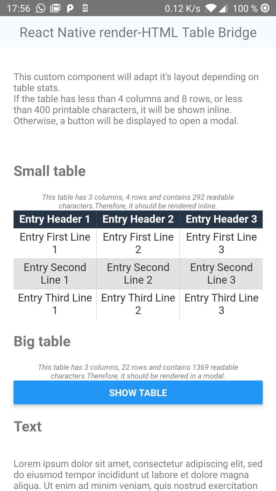

# Table support for react-native-render-html


```bash
npm add --save react-native-render-html-table-bridge
```

```bash
yarn add react-native-render-html-table-bridge
```

**Features**:

- Render HTML tables with a `WebView` component you provide
- Supports `<HTML>onLinkPress` prop to handle clicks
- Automatic height


**Known Limitations**:

- don't forget you're rendering cells inside a webview, so you won't be able to apply your custom renderers there
- limited support of Expo &lt;33 version ; full support [&ge;33 versions](https://github.com/expo/expo/milestone/22) (see bellow limitation)
- `autoheight` and `onLinkPress` config options only work with [`WebView` &ge; `v5.0.0` community edition](https://github.com/react-native-community/react-native-webview/releases/tag/v2.14.0)

## Minimal working example

*[Full example](examples/simple)*

You need 3 conditions to get to a working example:

1. Provide import for `WebView` component. [Instructions will differ depending on your setup](#errors-when-importing-webview-component);
2. Inject `alterNode` and `ignoredTags` props to `HTML` component;
3. `makeTableRenderer` and inject `renderers` prop to `HTML` component.

```javascript
import React, {PureComponent} from 'react';
import {ScrollView} from 'react-native';
import HTML from 'react-native-render-html';
import { IGNORED_TAGS, alterNode, makeTableRenderer } from 'react-native-render-html-table-bridge';
import WebView from 'react-native-webview'; // <-- Instructions might defer depending on your setup

const html = `
<table>
  <tr>
    <th>Entry Header 1</th>
    <th>Entry Header 2</th>
  </tr>
  <tr>
    <td>Entry First Line 1</td>
    <td>Entry First Line 2</td>
  </tr>
</table>
`;

const config = {
    WebViewComponent: WebView
};

const renderers = {
  table: makeTableRenderer(config)
};

const htmlConfig = {
  alterNode,
  renderers,
  ignoredTags: IGNORED_TAGS
};

export default class Example extends PureComponent<Props> {
  render() {
    return (
      <ScrollView>
        <HTML html={html} {...htmlConfig}/>
      </ScrollView>
    )
  }
}
```

## `makeTableRenderer` config

This config object will be passed to the [`HTMLTable`](src/HTMLTable/index.ts) component as props.

### `WebViewComponent`

*Required* `ComponentType`

Your `WebView` component. If importing this component causes errors, [check the dedicated troubleshooting section](#errors-when-importing-webview-component).

**Warning**: Features such as `autoheight` and `onLinkPress` don't work with the legacy core version or Expo &lt;33 version.

Please use latest [community edition instead](https://github.com/react-native-community/react-native-webview)

### `autoheight`

*Optional* `boolean`

Fit height to HTML content.

**default**: `true`

**Supported WebView**: `WebView` community edition &ge;5.0.0 and Expo SDK &ge;33.

**Warning**: When setting to false, you must either give container absolute positioning with `style` prop, or give a fixed height with `defaultHeight` prop.
Otherwise, React Native will assign a `0` height.

### `defaultHeight`

*Optional* `number`

If `autoheight` is set to `true`, the container will span to `defaultHeight` during content height computation.
Otherwise, container height will be fixed to `defaultHeight` before and after height computation.

### `maxHeight`

*Optional* `number`

Maximum container height.

**Warning**: Content should theoretically be scrollable on overflow, but there is a [**pending issue**](https://github.com/react-native-community/react-native-webview/issues/22) in `react-native-community/react-native-webview` which prevents `WebView` nested in a `ScrollView` to be scrollable.

### `style`

*Optional* `StyleProp<ViewStyle>`

Container style.

### `tableStyleSpecs`

*Optional* [`TableStyleSpecs`](src/HTMLTable/table-specs.d.ts)

An object describing the table appearance.

**default**: [*see definition*](src/HTMLTable/css-rules.ts)

### `cssRules`

*Optional* `string`

Override default CSS rules.

**Info**: When set, `tableStyleSpecs` is ignored.

### `webViewProps`

*Optional* `object`

Any properties you want to pass to the `WebViewComponent` element.

**Info**: `source`, `injectedJavascript`, `javascriptEnabled` and `onMessage`
will be ignored and overridden.

### `useLayoutAnimations`

*Optional* `boolean`

Use native `LayoutAnimation` instead of `Animated` module with `autoheight`.
This should be preferred performance-wise, but you need to setup `UIManager` on android.

[See official guide](https://facebook.github.io/react-native/docs/layoutanimation)

**default**: `false`

### `transitionDuration`

*Optional* `number`

The transition duration in milliseconds when table height is updated when `autoheight` is used.

**default**: `120`

## Troubleshooting


<a name="errors-when-importing-webview-component" />

### Errors when importing `WebView` component

Setting up `WebView` component largely vary on your `react-native` or `expo` version.
Please refer to the official documentation and make sure you have selected your RN / Expo SDK version:

- [Expo](https://docs.expo.io/versions/latest/sdk/webview/);
- [React Native](https://facebook.github.io/react-native/docs/webview).

## FAQ

### How to extend default or custom styles?

**A**: Use `cssRulesFromSpecs` function and override `cssRules` config.

```javascript
import { defaultTableStylesSpecs, cssRulesFromSpecs } from 'react-native-render-html-table-bridge';

const cssRules = cssRulesFromSpecs(defaultTableStylesSpecs) + `
a {
  text-transform: uppercase;
}
`

const config = {
  cssRules,
  // Other config options
}

```

### How to customize the Table component?

**A**: Use `makeCustomTableRenderer` function. [See custom example](examples/custom).



### How to load custom fonts?

**A**: Extend styles and add `@font-face` rules.

```javascript
import { defaultTableStylesSpecs, cssRulesFromSpecs } from 'react-native-render-html-table-bridge';
import { Platform } from 'react-native';

function getFontAssetURL(fontFileName: string) {
  return Platform.select({
    ios: `url(${fontFileName})`,
    android: `url(file://android_asset/fonts/${fontFileName})`
  })
}

const openSansUnicodeRanges = 'U+0000-00FF, U+0131, U+0152-0153, U+02BB-02BC, U+02C6, U+02DA, U+02DC, U+2000-206F, U+2074, U+20AC, U+2122, U+2191, U+2193, U+2212, U+2215, U+FEFF, U+FFFD';

const openSansRegular = getFontAssetURL('OpenSans-Regular.ttf');

const cssRules = cssRulesFromSpecs({
  ...defaultTableStylesSpecs,
  fontFamily: '"Open Sans"' // beware to quote font family name!
}) + `
@font-face {
  font-family: 'Open Sans';
  font-style: normal;
  font-weight: 400;
  src: ${openSansRegular}, format('ttf');
  unicode-range: ${openSansUnicodeRanges};
}
`;

const config = {
  cssRules,
  // Other config options
}

```
